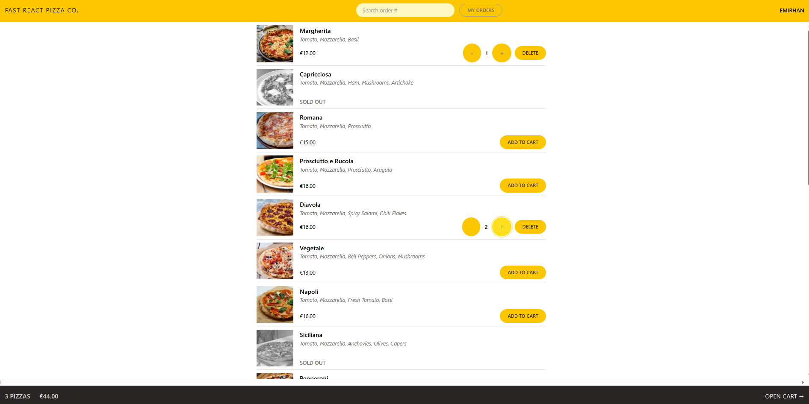
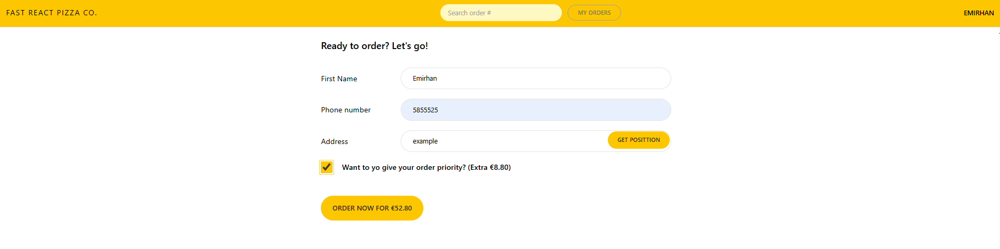
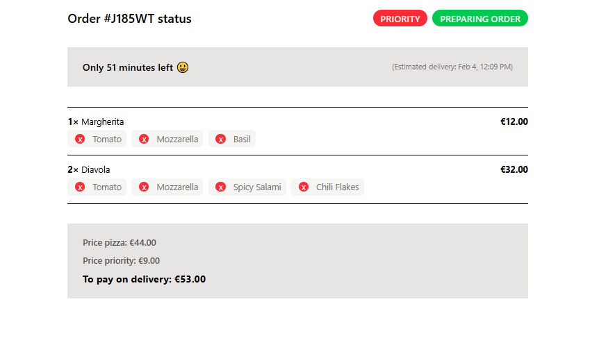
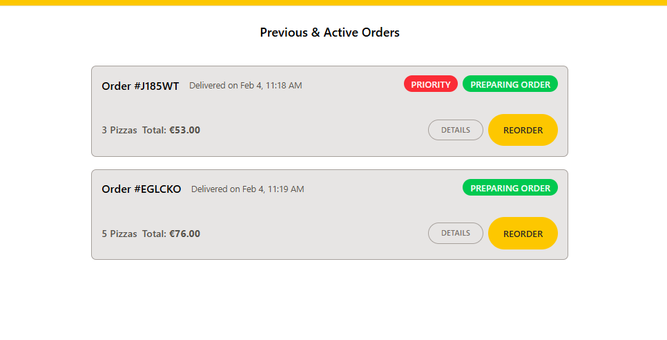

# PIZZA-CO 🍕

** A pizza delivery web application for managing orders, customers, and inventory. **

---

## Table of Contents

1. [About the Project](#about-the-project)
2. [Features](#features)
3. [Screenshots](#screenshots)
4. [Usage](#usage)
5. [License](#license)
6. [Contact](#contact)

---

## About the Project

PIZZA-CO is a comprehensive web application designed to streamline the operations of a pizza delivery business. Built with React for the frontend and Supabase API for the backend, this application allows users to efficiently manage pizza orders, customer information, and inventory levels.

## Features

- **Order Management**: Create, view, and manage pizza orders.
- **Customer Management**: Keep track of customer details and order history.
- **Inventory Management**: Monitor and update pizza ingredients and supplies.
- **Intuitive Interface**: User-friendly design for easy navigation and operation.

---

## Screenshots

### Main Page

### Menu Page

### Cart Page

### New Order Page

### Order Status

### Previous Orders

---

## Usage

1. **Log In**: Just enter your name to log in.
2. **Manage Menu**: Browse and select pizzas from the menu.
3. **Manage Cart**: Add items to the cart, update quantities, and remove items.
4. **Create New Order**: Proceed to checkout and create a new order.
5. **View Order Status**: Track the status of your current orders.
6. **View Previous Orders**: Review your past orders.

---

## License

Distributed under the MIT License. See `LICENSE` for more information.

---

## Contact

Emirhan Karagöz - [emirhan-karagoz1@hotmail.com](mailto:emirhan-karagoz1@hotmail.com)

Project Link: [GitHub Repository](https://github.com/Wallinera/Pizza-CO)

Live Site URL: [PIZZA-CO](https://pizza-co-five.vercel.app)
